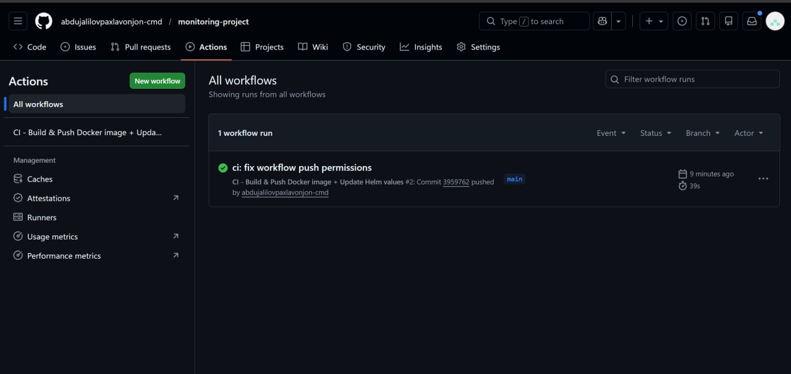
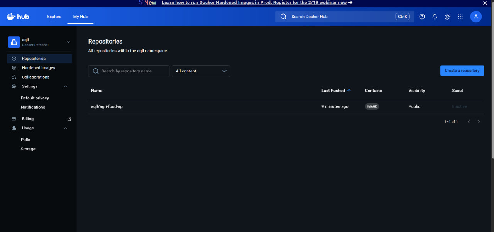
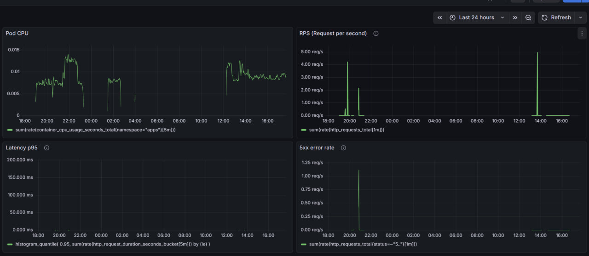
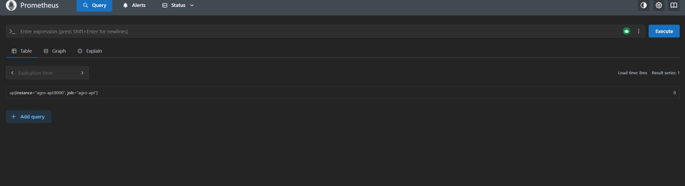
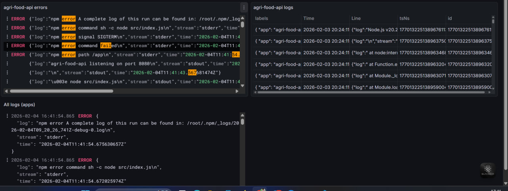

# 🌾 Agriculture Platform – End-to-End DevOps & Observability Project

This repository demonstrates a **production-ready DevOps project** that covers the full lifecycle:
**CI → Docker → GitOps → Kubernetes → Monitoring & Logging**.

---

## 🏗️ System Architecture Overview

The platform is deployed on Kubernetes and follows GitOps principles using ArgoCD.


---

## ⚙️ Technologies Used

- **Application:** Node.js (Agri-Food API)
- **Containerization:** Docker
- **CI/CD:** GitHub Actions
- **Image Registry:** Docker Hub
- **Orchestration:** Kubernetes
- **GitOps CD:** ArgoCD
- **Monitoring:** Prometheus
- **Visualization:** Grafana
- **Logging:** Loki
- **Alerting:** Alertmanager

---

## 🔄 Continuous Integration – GitHub Actions

Every push to the `main` branch triggers a CI pipeline that:

1. Builds a Docker image  
2. Pushes the image to Docker Hub  
3. Updates Helm `values.yaml` with a new image tag  
4. Commits changes back to the repository  



---

## 🐳 Docker Image Repository

The application image is automatically built and pushed to Docker Hub.



---

## ☸️ GitOps Deployment with ArgoCD

ArgoCD continuously monitors the Git repository and synchronizes Kubernetes manifests automatically.

- Git is the **single source of truth**
- Automatic sync & drift detection
- Rollback supported


---

## 📊 Monitoring – Grafana Dashboards

Grafana visualizes real-time metrics collected by Prometheus.

Key metrics:
- CPU usage
- Memory consumption
- Pod health
- Node health
- Application performance



---

## 📈 Prometheus Targets

Prometheus successfully scrapes metrics from:
- Application pods
- Node Exporter
- Kubernetes components



---

## 🪵 Centralized Logging – Grafana Loki

All application and system logs are collected and queried centrally using Loki.

- Namespace-level logs
- Pod-level filtering
- Fast troubleshooting



---

## 🚀 How to Run Locally

```bash
# Start Kubernetes cluster
minikube start

# Deploy monitoring stack
helm install monitoring prometheus-community/kube-prometheus-stack

# Access Grafana
kubectl port-forward svc/monitoring-grafana -n monitoring 3000:80

📂 Repository Structure

monitoring-project/
├── .github/workflows/        # CI pipelines
├── helm/agri-food-api/       # Helm chart for application
├── src/                      # Application source code
├── docs/                     # Documentation
├── Dockerfile                # App container build
├── README.md                 # Project documentation
├── argocd-app.png            # ArgoCD application
├── ci-github-actions.png     # CI pipeline screenshot
├── dockerhub-image.png       # Docker Hub image
├── grafana-dashboard.png     # Grafana dashboard
├── grafana-logs.png          # Loki logs
└── prometheus-targets.png    # Prometheus targets
